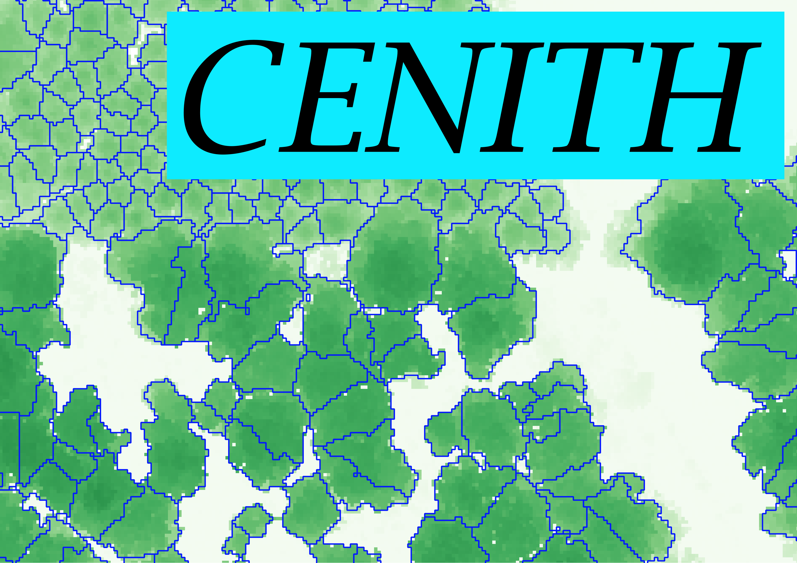

[](http://www.gnu.org/licenses/gpl-3.0.html)



## CENITH - Segmentation
This package is a wrapper for semi-automated segmentation based on watershed algorithm.
It deliveres functions to determine best fitting parameters  to receive higher precision.

For an introduction in CENITH see the vignette: CENITH_tutorial.html

## Installation
Install via devtools from github:

``` r
# current version
devtools::install_github("SchoenbergA/CENITH")

# install vignette for R-help (could take some time)
devtools::install_github("SchoenbergA/CENITH",build_vignettes=TRUE)
```
